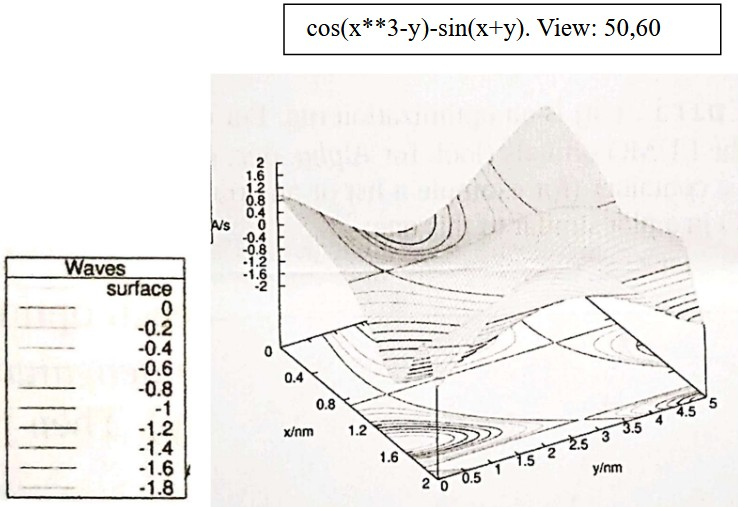

# ContourPlot Walkthrough: Creating a 3D Surface Plot with Contours

## Overview
This guide walks through creating a gnuplot visualization of the function $z = \cos(x^3 - y) - \sin(x + y)$ with surface shading and contour lines. The final plot includes a legend titled "Waves" and uses a 50° elevation and 60° azimuth viewing angle.

---
Make a gnuplot script that generates the following picture. Surface is depicted in gray. Line width and color of countour lines have default values.



## Part 1: Generating Data with Python

### Step 1.1: Import Libraries
```python
import numpy as np
```

### Step 1.2: Define the Function
```python
def compute_z(x, y):
    return np.cos(x**3 - y) - np.sin(x + y)
```

### Step 1.3: Create Mesh Grid
The key to gnuplot surface plots is creating a regular grid of (x, y) points and computing z values for each:

```python
x_min, x_max = -2, 2
y_min, y_max = -2, 2
x_points = np.linspace(x_min, x_max, 100)
y_points = np.linspace(y_min, y_max, 100)
X, Y = np.meshgrid(x_points, y_points)
```

**Key Point:** Using 100 points in each dimension creates a 100×100 grid, which provides smooth surface rendering without excessive file size.

### Step 1.4: Calculate Z Values
```python
Z = compute_z(X, Y)
```

### Step 1.5: Format Data for Gnuplot
Gnuplot expects data in specific format: three columns (x, y, z) separated by whitespace:

```python
data = []
for i in range(len(x_points)):
    for j in range(len(y_points)):
        data.append([X[j, i], Y[j, i], Z[j, i]])

data_array = np.array(data)
np.savetxt('values.dat', data_array, fmt='%.6f', delimiter=' ', header='x y z', comments='')
```

**Important:** The nested loop structure is critical—iterate over x in the outer loop and y in the inner loop to create the proper row-major ordering gnuplot expects for surface plotting.

---

## Part 2: Creating the Gnuplot Script

### Step 2.1: Set Output Format
```gnuplot
set terminal png size 800,600
set output 'plot.png'
```

**Tip:** Use `png` for high-quality raster output, or `pdfcairo` for vector PDF output. Adjust size as needed for publication.

### Step 2.2: Configure Labels and Title
```gnuplot
set xlabel 'X'
set ylabel 'Y'
set zlabel 'Z'
set title 'Surface Plot with Contours'
```

### Step 2.3: Enable Contour Lines (Topological Map)
```gnuplot
set contour base
set cntrparam levels 10
```

**Key Options:**
- `set contour base`: Places contour lines on the bottom plane
- `set cntrparam levels 10`: Creates 10 contour levels automatically distributed
- Alternative: `set cntrparam levels discrete 0.5, 1.0, 1.5, ...` for manual levels

### Step 2.4: Set Viewing Angle
```gnuplot
set view 50,60
```

This matches the exercise requirement: 50° elevation, 60° azimuth rotation.

### Step 2.5: Configure Surface Style (Gray Shading)
```gnuplot
set style data lines
set palette gray
```

**Alternative Palettes:**
- `set palette gray`: Grayscale (recommended for the exercise)
- `set palette color`: Rainbow colors
- `set palette defined (0 "white", 1 "black")`: Custom gradients

### Step 2.6: Add Legend with Title
```gnuplot
set key title "Waves" inside right top
```

**Legend Options:**
- `inside right top`: Position legend inside plot at top-right
- `outside right top`: Position legend outside plot area
- `left center`: Different position
- `title "Waves"`: Sets the legend box title

### Step 2.7: Plot with Surface and Contours
```gnuplot
splot 'values.dat' using 1:2:3 with pm3d title "Waves", \
      'values.dat' using 1:2:3 with lines title "Contours"
```

**Explanation:**
- `pm3d`: Creates the colored surface
- `with lines`: Overlays contour lines
- `title "Waves"`: Associates each line with the legend
- The backslash `\` continues the command on the next line

---

## Part 3: Gnuplot Tips and Tricks

### Tip 1: Improving Smooth Surfaces
If your surface appears faceted, increase the data resolution in Python:
```python
x_points = np.linspace(x_min, x_max, 150)  # Increase from 100
y_points = np.linspace(y_min, y_max, 150)
```

### Tip 2: Adjusting Contour Count
```gnuplot
set cntrparam levels 15  # More contour lines for finer detail
set cntrparam levels auto 20  # Auto-calculate up to 20 levels
```

### Tip 3: Hiding Surface for Contours Only
```gnuplot
set surface
set nosurface  # Comment out surface rendering
```

### Tip 4: Customizing Contour Colors
```gnuplot
set linestyle 1 lc rgb "black" lw 2
```

### Tip 5: Output to Multiple Formats
```gnuplot
# Create PNG
set terminal png
set output 'plot.png'
splot 'values.dat' using 1:2:3 with pm3d

# Then create PDF
set terminal pdfcairo
set output 'plot.pdf'
replot  # Replot with new terminal
```

---

## Complete Working Gnuplot Script

```gnuplot
#!/usr/bin/gnuplot

# Configure output
set terminal png size 800,600 enhanced
set output 'plot.png'

# Labels and title
set xlabel 'X' font "Arial,12"
set ylabel 'Y' font "Arial,12"
set zlabel 'Z' font "Arial,12"
set title 'z = cos(x³ - y) - sin(x + y)' font "Arial,14"

# Viewing angle (50° elevation, 60° azimuth)
set view 50,60

# Enable contours at the base
set contour base
set cntrparam levels 10

# Surface styling - gray palette
set style data lines
set palette gray
set pm3d

# Legend configuration
set key inside right top title "Waves" font "Arial,11"

# Margins for better spacing
set lmargin 10
set rmargin 10
set tmargin 5
set bmargin 5

# Plot with surface and contours
set dgrid3d 30,60
splot 'values.dat' using 1:2:3 with pm3d notitle, \
      'values.dat' using 1:2:3 with lines lc black lw 0.5 notitle

# Keep window open (for interactive terminal)
# pause -1
```

---

## Complete Python Data Generation Script

```python
import numpy as np

def compute_z(x, y):
    """
    Compute the z value for the given function.
    
    Args:
        x: x-coordinate(s)
        y: y-coordinate(s)
    
    Returns:
        z = cos(x^3 - y) - sin(x + y)
    """
    return np.cos(x**3 - y) - np.sin(x + y)


def generate_data(x_min=-2, x_max=2, y_min=-2, y_max=2, resolution=100):
    """
    Generate a regular mesh grid and compute z values.
    
    Args:
        x_min, x_max: Range for x values
        y_min, y_max: Range for y values
        resolution: Number of points per dimension (resolution x resolution grid)
    
    Returns:
        data_array: Numpy array with shape (resolution^2, 3) containing [x, y, z]
    """
    # Create linearly spaced points
    x_points = np.linspace(x_min, x_max, resolution)
    y_points = np.linspace(y_min, y_max, resolution)
    
    # Create mesh grid
    X, Y = np.meshgrid(x_points, y_points)
    
    # Calculate z values
    Z = compute_z(X, Y)
    
    # Flatten and combine into data array
    # Critical: iterate over x in outer loop, y in inner loop for proper gnuplot ordering
    data = []
    for i in range(len(x_points)):
        for j in range(len(y_points)):
            data.append([X[j, i], Y[j, i], Z[j, i]])
    
    return np.array(data), (x_min, x_max, y_min, y_max), Z


def save_to_file(data_array, filename='values.dat'):
    """
    Save the data array to a file in gnuplot-compatible format.
    
    Args:
        data_array: Numpy array with shape (N, 3) containing [x, y, z]
        filename: Output filename
    """
    np.savetxt(filename, data_array, fmt='%.6f', delimiter=' ', 
               header='x y z', comments='')
    print(f"✓ Data file '{filename}' created successfully!")


def print_statistics(data_array, ranges, Z):
    """Print information about the generated data."""
    x_min, x_max, y_min, y_max = ranges
    
    print("\n" + "="*60)
    print("DATA GENERATION STATISTICS")
    print("="*60)
    print(f"Function: z = cos(x³ - y) - sin(x + y)")
    print(f"\nGrid Dimensions:")
    print(f"  Total points: {len(data_array):,}")
    print(f"  Grid size: {int(np.sqrt(len(data_array)))}x{int(np.sqrt(len(data_array)))}")
    print(f"\nCoordinate Ranges:")
    print(f"  X range: [{x_min}, {x_max}]")
    print(f"  Y range: [{y_min}, {y_max}]")
    print(f"  Z range: [{data_array[:, 2].min():.6f}, {data_array[:, 2].max():.6f}]")
    print(f"\nData Statistics:")
    print(f"  X mean: {data_array[:, 0].mean():.6f}")
    print(f"  Y mean: {data_array[:, 1].mean():.6f}")
    print(f"  Z mean: {data_array[:, 2].mean():.6f}")
    print(f"  Z std dev: {data_array[:, 2].std():.6f}")
    print(f"\nSample data (first 5 points):")
    print("  X         Y         Z")
    for row in data_array[:5]:
        print(f"  {row[0]:8.6f}  {row[1]:8.6f}  {row[2]:8.6f}")
    print("="*60 + "\n")


if __name__ == "__main__":
    # Generate data with 100×100 resolution
    print("Generating data for z = cos(x³ - y) - sin(x + y)...")
    data_array, ranges, Z = generate_data(x_min=0, x_max=2, y_min=0, y_max=5, resolution=100)
    
    # Save to file
    save_to_file(data_array, 'values.dat')
    
    # Print statistics
    print_statistics(data_array, ranges, Z)
    
    print("Ready to use values.dat with gnuplot!")
```

---

## Execution Instructions

### Step 1: Generate Data
```bash
python generate_data.py
```
This creates `values.dat` with 10,000 data points.

### Step 2: Run Gnuplot Script
```bash
gnuplot plot.gnuplot
```
This generates `plot.png`.

### Alternative: Interactive Gnuplot Session
```bash
gnuplot
gnuplot> load 'plot.gnuplot'
```

---

## Troubleshooting

### Problem: Contour lines don't appear
**Solution:** Ensure `set contour base` is before the `splot` command and data is properly formatted.

### Problem: Surface looks faceted/blocky
**Solution:** Increase resolution in Python:
```python
resolution = 150  # or higher
```

### Problem: Legend doesn't show "Waves" title
**Solution:** Use `set key title "Waves"` and ensure you have `notitle` on the splot lines.

### Problem: Gnuplot can't find values.dat
**Solution:** Ensure both `values.dat` and `plot.gnuplot` are in the same directory, or provide full paths.

---

## Understanding the Function

The function $z = \cos(x^3 - y) - \sin(x + y)$ combines:
- A cubic exponential component: $\cos(x^3 - y)$ creates strong x-axis variations
- A linear component: $-\sin(x + y)$ adds wave-like oscillations
- Together, they create complex interference patterns visible as contour "waves"

This is why the legend title "Waves" is particularly fitting—the contour lines form wave-like patterns across the surface.

---

## Customization Ideas

1. **Change Color Palette:**
   ```gnuplot
   set palette defined (0 "white", 0.5 "blue", 1 "black")
   ```

2. **Logarithmic Scaling:**
   ```gnuplot
   set logscale z
   ```

3. **Different View Angles:**
   ```gnuplot
   set view 60, 45    # Higher elevation, different azimuth
   set view 0, 0      # Top-down view (shows contours best)
   ```

4. **Add Lighting:**
   ```gnuplot
   set pm3d depthorder
   set pm3d lighting Phong 0.5
   ```
