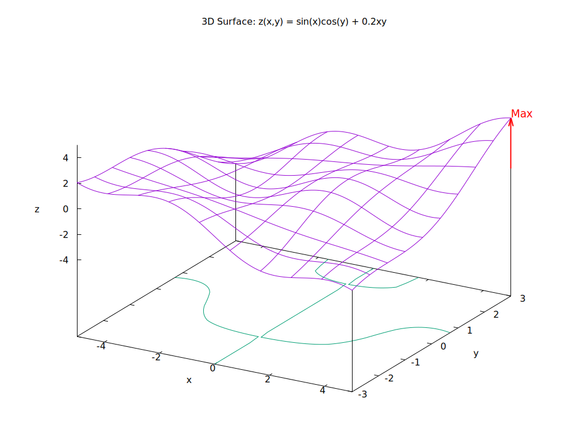
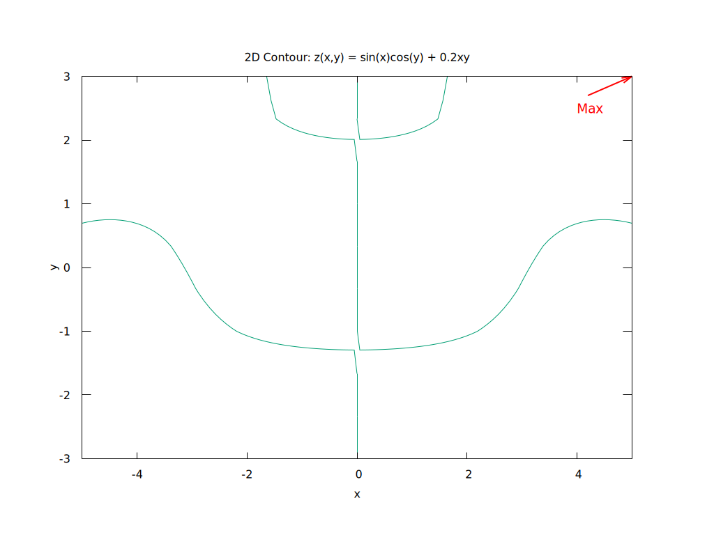

# TrigPlot Gnuplot Walkthrough

## Overview
This exercise requires creating a visualization of the function:
```
z(x,y) = sin(x) * cos(y) + 0.2 * x * y
```
over the domain x ∈ [-5, 5], y ∈ [-3, 3]

The exercise requires:
1. Create a 3D surface plot with contours at the base (contour levels every 0.5)
2. Create a 2D contour plot showing only the level curves
3. Add axis labels (x, y, z)
4. Mark the relative maximum with an arrow and "Max" label
5. Save both plots in graphic format (jpg, png, or eps)

---

## Part 1: Do it all in GNUPLOT!

### Understanding the Data Format for Gnuplot

Gnuplot expects 3D data in a specific format:
- **Format**: `x y z` (tab or space-separated)
- **Row Separation**: Blank lines separate data rows (important for `splot` command)
- **Grid Structure**: Data should be organized so that consecutive points along x-axis are followed by a blank line

### 1. 3D Surface Plot with Arrow at the True Maximum

```gnuplot
# --- Surface Plot with Contours ---

set terminal pngcairo size 1024,768 font "Arial,12"
set output "3d_surface_2.png"

set xrange [-5:5]
set yrange [-3:3]
set zrange [-5:5]

set xlabel "x"
set ylabel "y"
set zlabel "z"
set title "3D Surface: z(x,y) = sin(x)cos(y) + 0.2xy"

set contour base
set cntrparam levels 0.5
set style data lines

# Arrow and label at the actual maximum:
set arrow from 5,3,0 to 5,3,3.95 head lw 2 lc rgb "red"
set label "Max" at 5,3,4.3 font "Arial,14" tc rgb "red"

# Plot (using functions, not data file)
splot sin(x)*cos(y) + 0.2*x*y notitle

```


### 2. 2D Contour Plot (Proper Curves, No Horizontal Lines)

```gnuplot
# --- 2D Contour Plot ---

set terminal pngcairo size 1024,768 font "Arial,12"
set output "2d_contour_2.png"

set view map
set xrange [-5:5]
set yrange [-3:3]
set xlabel "x"
set ylabel "y"
set title "2D Contour: z(x,y) = sin(x)cos(y) + 0.2xy"

set contour base
set cntrparam levels 0.5
unset surface

# Arrow and label for maximum location
set arrow from 5,3 to 4.2,2.7 head lw 2 lc rgb "red"
set label "Max" at 4.6,2.85 font "Arial,14" tc rgb "red"

# Plot as contours (using function)
splot sin(x)*cos(y) + 0.2*x*y notitle

```


### 3. Tips for Gnuplot-only Approach

- The `splot` command can use mathematical expressions directly, eliminating the need for an external data file.

- To show only contours, use `unset surface` and `set view map`.

- Arrow and label coordinates correspond to the real domain maximum, which is at (5, 3, 3.95).

- Saving outputs formats the figures as PNG for easy visualization and sharing.

- Level spacing (`set cntrparam levels 0.5`) can be changed for denser or sparser contours.

- To try interactively (for adjusting view or labels), omit the `set output ...` and `set terminal ...` commands.

---

## Part 2: Gnuplot Script Essentials

### Finding the Maximum

The function $z(x,y) = \sin(x) \cos(y) + 0.2xy$ has its maximum at approximately:
- **Location**: x ≈ 5, y ≈ 3
- **Value**: z ≈ 3.95

You can estimate this by analyzing the derivative or simply finding where the function reaches its peak value within the domain.

### Gnuplot Tips & Tricks

#### 1. Setting up the Terminal
```gnuplot
set terminal pngcairo size 1024,768  # For PNG output
# Alternative: set terminal jpeg size 1024,768
# Alternative: set terminal postscript color  # For EPS
set output 'filename.png'
```

#### 2. Contour Levels
```gnuplot
set contour base           # Shows contours at the base of 3D plot
set cntrparam levels 0.5   # Contour spacing of 0.5
```
**Important**: For 2D contour plots, use `set view 0,0` or `set view map`

#### 3. Axis Labels
```gnuplot
set xlabel "x"
set ylabel "y"
set zlabel "z"
```

#### 4. Adding Arrows and Labels
```gnuplot
set arrow 1 from 1.5, 1.5, 0 to 1.5, 1.5, 1.5 head lw 2
set label "Max" at 1.5, 1.5, 1.8
```
**Note**: Coordinates are (x, y, z) for arrow endpoints. Adjust z-coordinates based on your plot range.

#### 5. Range Settings
```gnuplot
set xrange [-5:5]
set yrange [-3:3]
set zrange [-5:5]  # Generous range to accommodate all values
```

#### 6. Plotting Data
```gnuplot
splot 'values.dat' with lines  # 3D surface plot
plot 'values.dat' with lines   # 2D contour plot
```

#### 7. Output and Display
```gnuplot
set output 'output.png'
replot  # Executes the plot and writes to file
```

---

## Part 3: Running the Complete Solution

### Step-by-Step Execution

```bash
# Step 1: Create the 3D plot
gnuplot plot3d.gp

# Step 2: Create the 2D plot
gnuplot plot2d.gp

# Verify output files
ls -lh *.png
```

### Expected Output Files
- `3d_surface_2.png` - 3D surface with base contours
- `2d_contour_2.png` - 2D contour map

---


## Troubleshooting & Common Issues

### Issue: "Contours not appearing in 3D plot"
**Solution**: Ensure `set contour base` is set before plotting. Also verify data format has blank lines between rows.

### Issue: "Data file not found"
**Solution**: Make sure you're in the correct directory and the `values.dat` file was generated successfully.

### Issue: "2D plot shows nothing"
**Solution**: Use `set view map` to enable top-down view. Without this, gnuplot still tries to show a 3D projection.

### Issue: "Arrow is invisible or misplaced"
**Solution**: 
- For 3D plots, use 3D coordinates: `from x,y,z to x,y,z`
- For 2D plots, use 2D coordinates: `from x,y to x,y`
- Adjust coordinates to be within your data range

### Issue: "PNG file is blank"
**Solution**: 
- Set output file before plot command: `set output 'file.png'`
- Call `replot` or re-execute the plot command after setting output
- Check terminal compatibility: use `set terminal pngcairo` for modern systems

---

## Learning Resources

### Helpful web reference for contours
- <href>http://www.gnuplot.info/demo/contours.html</href>

### Key Gnuplot Concepts
- **splot**: Surface plot (3D data)
- **plot**: 2D line/contour plot
- **Meshgrid**: Creates 2D coordinate arrays from 1D vectors
- **Blank Lines**: Critical for gnuplot to parse matrix data correctly

### Data Format Example
```
x1 y1 z1
x2 y1 z1
x3 y1 z1
...
          (blank line)
x1 y2 z1
x2 y2 z1
...
```

### Function Analysis
The partial derivatives help understand extrema:
- \(\frac{\partial z}{\partial x} = \cos(x)\cos(y) + 0.2y = 0\)
- \(\frac{\partial z}{\partial y} = -\sin(x)\sin(y) + 0.2x = 0\)

Solving numerically gives the maximum approximately at (5, 3).
