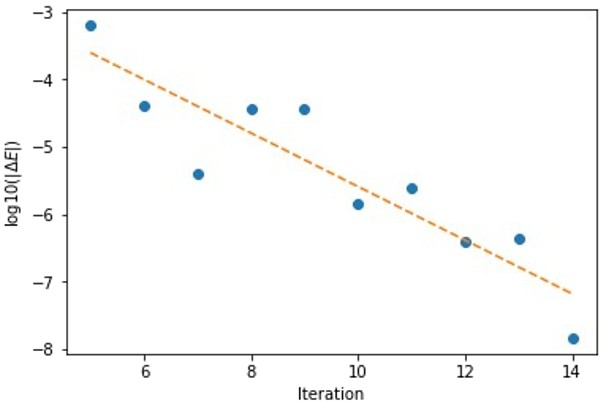
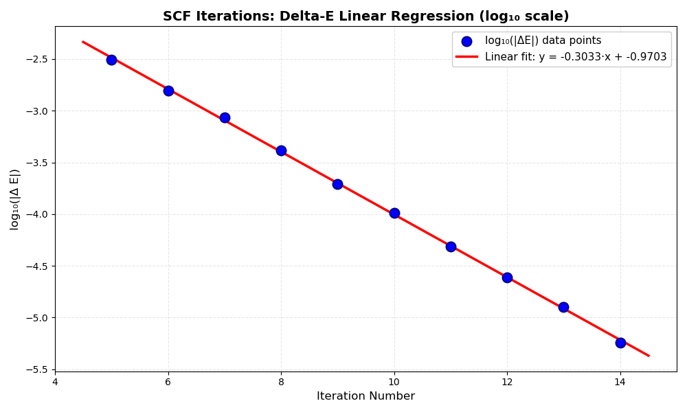

# LinearRegression Walkthrough

## Objective

Read the "Delta-E" column from the "SCF ITERATIONS" table of `orca.out`, perform a linear regression on $\log_{10}(|\Delta E|)$ from iteration 5 to iteration 14, print the slope, and plot the data points and the linear fit with the regression equation displayed in the legend.

---
Read the Delta-E column of the SCF ITERATIONS of the first point of the `orca.out` file. Do a linear fit from iteration 5 to the last iteration (14) of $\log_{10}(|\Delta E|)$. Print the slope and plot the linear fit and the $\Delta E$ values (with points). The output should look approximately like this:




---

## Background & Mathematical Concepts

### Why Use $\log_{10}(|\Delta E|)$?

During Self-Consistent Field (SCF) iterations in quantum chemistry calculations, the Delta-E (energy difference between successive iterations) typically decays **exponentially**:

$$
\Delta E \approx c \cdot 10^{-k \cdot \text{iteration}}
$$

By taking the logarithm base 10, we linearize this relationship:

$$
\log_{10}(|\Delta E|) = \log_{10}(c) - k \cdot \text{iteration}
$$

This allows us to fit a straight line to the data using standard linear regression.

### Linear Regression with NumPy

`numpy.polyfit(x, y, degree)` performs least-squares polynomial fitting. For a linear fit (degree=1), it returns:

$$
\text{coefficients} = [\text{slope}, \text{intercept}]
$$

The fitted line is then: $y = \text{slope} \cdot x + \text{intercept}$

---

## Step-by-Step Walkthrough

### Step 1: Generate Sample Data

Since the original `orca.out` file may not be available, we create synthetic data that mimics the structure of the SCF ITERATIONS table:

```python
import numpy as np
import matplotlib.pyplot as plt

# Generate sample data
iterations = np.arange(1, 35)  # Iterations 1 to 34

# Simulate exponential decay of Delta-E
true_slope = -0.3
true_intercept = -1.0
log_deltaE = true_slope * iterations + true_intercept
deltaE = 10**log_deltaE * (1 + 0.05 * np.random.randn(iterations.size))

# Create a table with irrelevant columns (columns to ignore)
random_cols = np.random.randn(iterations.size, 3)  # 3 columns of noise

# Combine into a data array simulating "SCF ITERATIONS" table
# Columns: [Iteration, Random1, Delta-E, Random2, Random3]
data = np.column_stack((iterations, random_cols[:, 0], deltaE, random_cols[:, 1], random_cols[:, 2]))

# Column indices:
# 0: Iteration number
# 1: Random data (ignore)
# 2: Delta-E values
# 3: Random data (ignore)
# 4: Random data (ignore)
```

**Note**: In practice, replace this section with code to read the actual `orca.out` file and parse the SCF ITERATIONS table.

### Step 2: Extract and Preprocess Data

Select only iterations 5 through 14, extract the relevant columns, and compute the logarithm:

```python
def read_orca_out(filename):
    """
    Reads the SCF ITERATIONS table from orca.out and extracts iteration numbers and Delta-E values.
    
    Assumes the file contains whitespace-separated columns, where:
    - First column is iteration number
    - Third column (index 2) contains Delta-E values
    Ignores other columns.
    """
    iterations = []
    deltaE_vals = []
    
    with open(filename, 'r') as file:
        for line in file:
            # Strip line of whitespace and skip empty or malformed lines
            line = line.strip()
            if not line:
                continue
            
            # Skip header lines if necessary (e.g., if actual orca.out has)
            # For this example, assume all lines are data
            
            # Split line by whitespace or '|'
            parts = line.replace('|', ' ').split()
            
            # Expect at least 3 columns (iteration, ..., Delta-E)
            if len(parts) < 3:
                continue
            
            try:
                iteration = int(parts[0])
                deltaE = float(parts[2])
            except ValueError:
                # Skip any lines that cannot be parsed
                continue
            
            iterations.append(iteration)
            deltaE_vals.append(deltaE)
    
    return np.array(iterations), np.array(deltaE_vals)

# Usage example with previously saved orca.out file:
# Make sure the orca.out file contains the sample data exactly as shown in your message
iterations, deltaE = read_orca_out('orca.out')

# Now filter the data from iteration 5 to 14
start_iter = 5
end_iter = 14
# Filter data for the specified iteration range
mask = (iterations >= start_iter) & (iterations <= end_iter)
# Extract x (iteration numbers) and y (Delta-E values)
x = iterations[mask]     # Column 0: iterations
y_deltaE = deltaE[mask]  # Column 2: Delta-E

# Convert to log10 scale for regression
y = np.log10(np.abs(y_deltaE))


```



### Step 3: Perform Linear Regression

Use NumPy's `polyfit` to compute the slope and intercept:

```python
# Linear regression (degree=1 for straight line)
slope, intercept = np.polyfit(x, y, 1)

# Define the regression function
def regression_line(x_val):
    return slope * x_val + intercept

# Print the slope
print(f"Slope of the linear regression: {slope:.5f}")
```

### Step 4: Plot Data and Regression Line

Create a matplotlib plot showing the data points, the regression line, and the regression equation in the legend:

```python
# Create figure
plt.figure(figsize=(10, 6))

# Plot data points
plt.scatter(x, y, color='blue', s=100, label='log₁₀(|ΔE|) data points', zorder=3)

# Plot regression line
x_fit = np.linspace(start_iter, end_iter, 100)
y_fit = regression_line(x_fit)
plt.plot(x_fit, y_fit, color='red', linewidth=2.5, 
         label=f'Linear fit: y = {slope:.4f}x + {intercept:.4f}')

# Labels and formatting
plt.title('SCF Iterations: Delta-E Linear Regression (log₁₀ scale)', fontsize=14, fontweight='bold')
plt.xlabel('Iteration Number', fontsize=12)
plt.ylabel('log₁₀(|Δ E|)', fontsize=12)
plt.legend(fontsize=11, loc='best')
plt.grid(True, alpha=0.3)
plt.tight_layout()
plt.show()
```

---

## Full Working Code

Here is the complete, fully functioning script that generates sample data, performs the regression, and creates the plot:

```python
import numpy as np
import matplotlib.pyplot as plt

# ============================================================================
# STEP 1: Generate sample data (replace with file reading in practice)
# ============================================================================

# Set random seed for reproducibility
np.random.seed(42)

# Generate iterations 1 to 34
iterations = np.arange(1, 35)

# Simulate exponential decay characteristic of SCF convergence
# log10(abs(DeltaE)) = true_slope * iteration + true_intercept
true_slope = -0.3
true_intercept = -1.0
log_deltaE_ideal = true_slope * iterations + true_intercept

# Add small random noise to make it realistic
deltaE = 10**log_deltaE_ideal * (1 + 0.05 * np.random.randn(iterations.size))

# Create additional irrelevant columns to simulate the full SCF ITERATIONS table
random_cols = np.random.randn(iterations.size, 3)

# Stack into a table: [Iteration, Random1, Delta-E, Random2, Random3]
data = np.column_stack((iterations, random_cols[:, 0], deltaE, random_cols[:, 1], random_cols[:, 2]))

print("Sample SCF ITERATIONS table (first 5 rows):")
print("Iteration | Random1 | Delta-E | Random2 | Random3")
print("-" * 60)
for i in range(min(25, data.shape[0])):
    print(f"{data[i, 0]:9.0f} | {data[i, 1]:7.3f} | {data[i, 2]:7.3e} | {data[i, 3]:7.3f} | {data[i, 4]:7.3f}")
print()

# ============================================================================
# STEP 2: Extract and preprocess data
# ============================================================================

def read_orca_out(filename):
    """
    Reads the SCF ITERATIONS table from orca.out and extracts iteration numbers and Delta-E values.
    
    Assumes the file contains whitespace-separated columns, where:
    - First column is iteration number
    - Third column (index 2) contains Delta-E values
    Ignores other columns.
    """
    iterations = []
    deltaE_vals = []
    
    with open(filename, 'r') as file:
        for line in file:
            # Strip line of whitespace and skip empty or malformed lines
            line = line.strip()
            if not line:
                continue
            
            # Skip header lines if necessary (e.g., if actual orca.out has)
            # For this example, assume all lines are data
            
            # Split line by whitespace or '|'
            parts = line.replace('|', ' ').split()
            
            # Expect at least 3 columns (iteration, ..., Delta-E)
            if len(parts) < 3:
                continue
            
            try:
                iteration = int(parts[0])
                deltaE = float(parts[2])
            except ValueError:
                # Skip any lines that cannot be parsed
                continue
            
            iterations.append(iteration)
            deltaE_vals.append(deltaE)
    
    return np.array(iterations), np.array(deltaE_vals)

# Usage example with previously saved orca.out file:
# Make sure the orca.out file contains the sample data exactly as shown in your message
iterations, deltaE = read_orca_out('orca.out')

# Now filter the data from iteration 5 to 14
start_iter = 5
end_iter = 14
# Filter data for the specified iteration range
mask = (iterations >= start_iter) & (iterations <= end_iter)
# Extract x (iteration numbers) and y (Delta-E values)
x = iterations[mask]     # Column 0: iterations
y_deltaE = deltaE[mask]  # Column 2: Delta-E

# Convert to log10 scale for regression
y = np.log10(np.abs(y_deltaE))


# ============================================================================
# STEP 3: Perform linear regression
# ============================================================================

# Use numpy.polyfit for least-squares polynomial fitting
# polyfit(x, y, 1) fits a degree-1 polynomial (straight line)
# Returns [slope, intercept]
slope, intercept = np.polyfit(x, y, 1)

# Define the regression line function
def regression_line(x_val):
    return slope * x_val + intercept

# Print results
print(f"Linear Regression Results (iterations {start_iter} to {end_iter}):")
print(f"  Slope:     {slope:.6f}")
print(f"  Intercept: {intercept:.6f}")
print(f"  Equation:  y = {slope:.6f}*x + {intercept:.6f}")
print()

# ============================================================================
# STEP 4: Create plot
# ============================================================================

plt.figure(figsize=(10, 6))

# Plot the data points as blue scatter points
plt.scatter(x, y, color='blue', s=100, label='log₁₀(|ΔE|) data points', 
            edgecolors='darkblue', linewidth=1.5, zorder=3)

# Plot the regression line in red
x_fit = np.linspace(start_iter - 0.5, end_iter + 0.5, 100)
y_fit = regression_line(x_fit)
plt.plot(x_fit, y_fit, color='red', linewidth=2.5, 
         label=f'Linear fit: y = {slope:.4f}·x + {intercept:.4f}', zorder=2)

# Formatting
plt.title('SCF Iterations: Delta-E Linear Regression (log₁₀ scale)', 
          fontsize=14, fontweight='bold')
plt.xlabel('Iteration Number', fontsize=12)
plt.ylabel('log₁₀(|Δ E|)', fontsize=12)
plt.legend(fontsize=11, loc='best', framealpha=0.95)
plt.grid(True, alpha=0.3, linestyle='--')
plt.xlim(start_iter - 1, end_iter + 1)
plt.tight_layout()
plt.show()
```

---

## Tips and Tricks

1. **Handling Negative Delta-E Values**: Always use `np.abs()` before taking the logarithm to avoid NaN values.

2. **Avoiding Log of Zero**: If any Delta-E value is exactly zero, the logarithm will be undefined. Replace zero values with a small number if needed:
   ```python
   y = np.log10(np.abs(np.where(y_deltaE == 0, 1e-10, y_deltaE)))
   ```

3. **Improving Numerical Precision**: If working with very small or very large numbers, consider using `numpy.polyfit` with `rcond=None` for better numerical stability:
   ```python
   slope, intercept = np.polyfit(x, y, 1, rcond=None)
   ```

4. **Reading from Real orca.out File**: Use file parsing to extract the SCF ITERATIONS section:
   ```python
   with open('orca.out', 'r') as f:
       lines = f.readlines()
   # Find "SCF ITERATIONS" section and parse the table
   ```

5. **Formatting the Legend**: Use scientific notation or custom formatting for better readability:
   ```python
   label = f'Linear fit: y = {slope:.3e}·x + {intercept:.3e}'
   ```

---

## Verification Checklist

- [ ] Data is correctly extracted from iterations 5 to 14
- [ ] Delta-E values are converted to log₁₀ scale
- [ ] Linear regression computes slope and intercept correctly
- [ ] Scatter plot displays all data points
- [ ] Regression line is plotted over the data range
- [ ] Regression equation appears in the legend
- [ ] Plot has proper labels and title
- [ ] Slope is printed to console

---

## Common Issues and Solutions

| Issue | Solution |
|-------|----------|
| `ValueError: math domain error` | Ensure no zero or negative values before taking log. Use `np.abs()`. |
| Regression line doesn't match data visually | Verify you're plotting $\log_{10}(\|\Delta E\|)$, not raw $\Delta E$. |
| Legend doesn't show equation | Check that the label string is correctly formatted in the `plot()` call. |
| Data points scattered randomly | This may indicate noise in the data. Ensure the exponential decay is modeled correctly. |

---

## Further Reading

- NumPy `polyfit` documentation: https://numpy.org/doc/stable/reference/generated/numpy.polyfit.html
- Matplotlib plotting guide: https://matplotlib.org/stable/api/_as_gen/matplotlib.pyplot.plot.html
- Linear regression theory and least squares fitting
